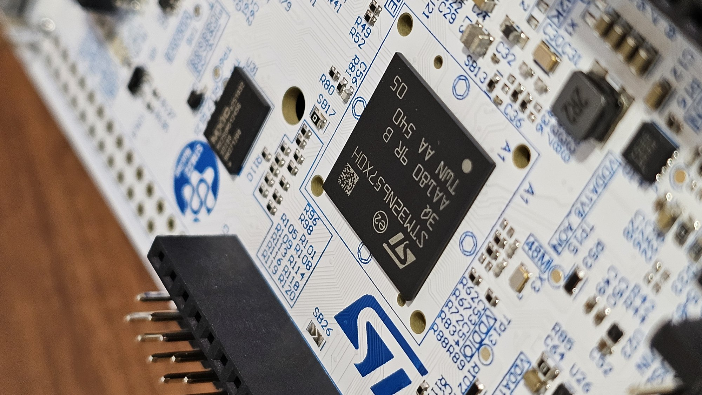
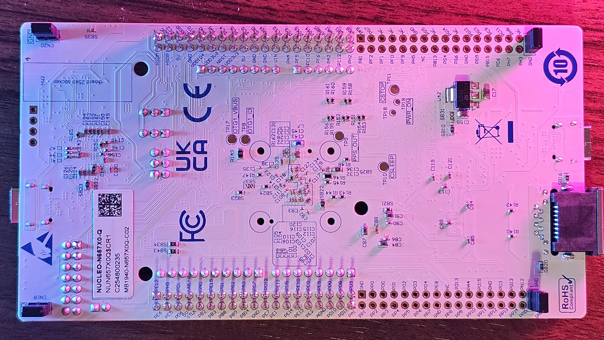
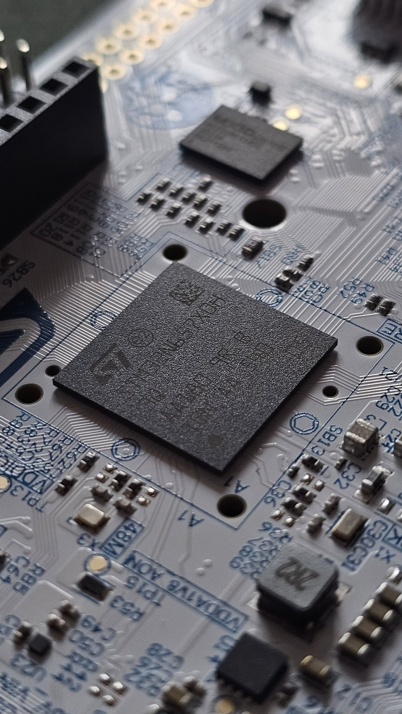
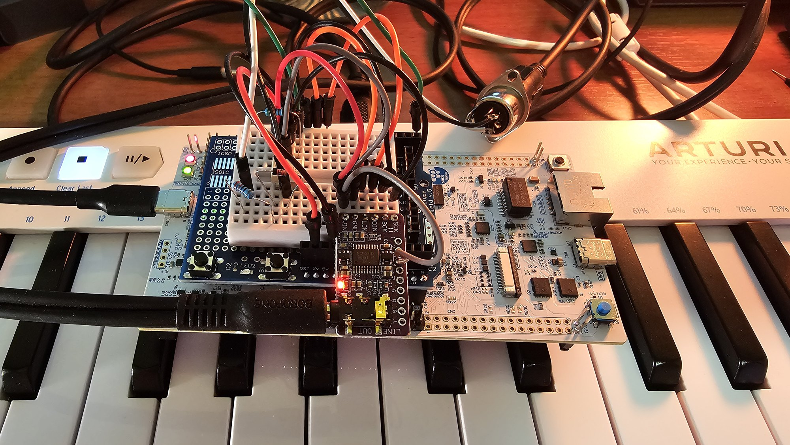
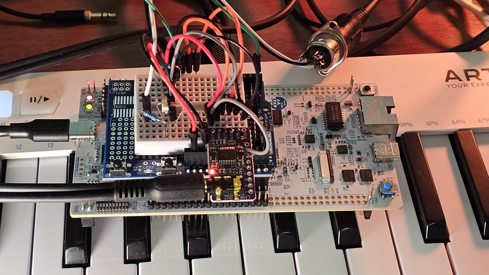
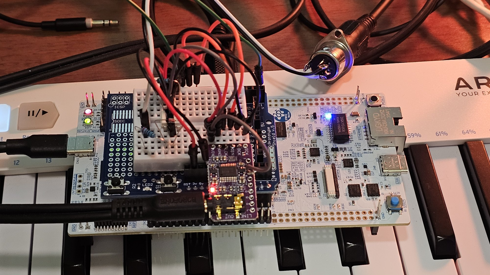
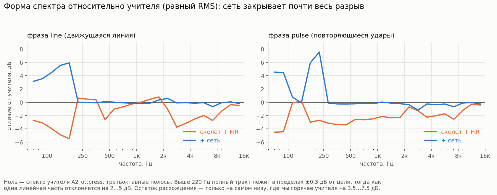
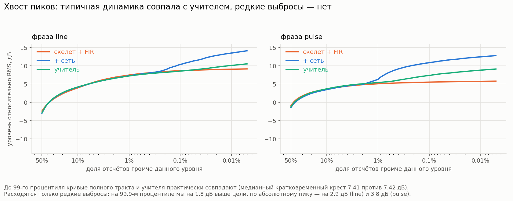

# Tymbal — a neural synthesizer on a single chip

*Article draft, 4 Aug 2026. Every number here comes from the repository
journals (docs/). I write nothing here from memory: I have been wrong too
often.*

## 0. About the name

The instrument is called **Tymbal**.

The character is set by the teacher — the processed signal the refiner is
trained against. Swap the teacher and the character changes completely, while
the construction stays the same.

**Tymbal** is the sound-producing organ of a cicada: a ribbed membrane that
clicks as it buckles nonlinearly. A small apparatus, a loud result rich in
overtones, and the whole mechanism rests on a single nonlinearity. In our case
the teacher's nonlinearity is carried by the network onto a deterministic
skeleton, and all of it lives on one chip.

The word also comes from the same place as "timbre". Merriam-Webster derives
`tymbal` as an alteration of the earlier `timbal` (kettledrum), and `timbre`
from the Greek `tympanon`, a drum: in Old French it is still a drum, in Middle
French a bell under a hammer, and only later did the word come to mean the
color of a sound. The instrument's name and the word "timbre" are relatives
through the drum.

I wrote the first version with an `i`, as in the kettledrum. I had to rename
it: on a cicada it is `tymbal`, with a `y`.

`N6` further down is the working index taken from the chip's name; it survived
in file and branch names.

## 1. The concept

A polyphonic real-time synthesizer on a single NUCLEO-N657X0-Q board
(STM32N657: Cortex-M55 at 800 MHz + Neural-ART neural accelerator). Control is
an ordinary MIDI keyboard over DIN, output is an I2S DAC. The aesthetic is
synthetic glitch melodism in the spirit of Alva Noto × Sakamoto, deliberately
NOT an imitation of an acoustic instrument.

The engineering statement is harsher than the artistic one. Sound is computed
in blocks (hop) of 4 ms; at 800 MHz that is 3.2 million cycles for everything:
voices, harmonic synthesis, the network, the filter bank, wow and flutter, the
limiter. Not one dropped block, `underrun` strictly zero.

What follows is how I fit into that budget, what I had to measure, and which
of my ideas about the chip turned out to be wrong. Almost all of them turned
out to be wrong.

The network's role was chosen to be non-decorative: it has to do what cheap
DSP cannot (the measure is in §4), and it has to run in every hop.

## 2. Architecture of the chain

```
MIDI (DIN, USART3) → voice manager (250 Hz frames: f0, amp, timbre axes)
  → skeleton: harmonic bank (up to 100 harmonics) + noise,
    rendered DIRECTLY into 4 PQMF subbands (12 kHz each)    [M55, MVE]
  → residual refiner: FIR bank 4×4 (linear part)            [M55]
    + TCN network (nonlinear delta)                         [NPU]
  → PQMF synthesis 4×12k → 48 kHz                           [M55, MVE]
  → wow/flutter + hiss (vintage layer)                      [M55]
  → peak limiter → SAI → DAC
```

Key decisions about the form:

**The PQMF domain.** All the "musical" work happens in four 12 kHz subbands:
the skeleton render as well as the network's input and output. This divides
the cost by four and, more importantly, gives the network a compact input. The
bank: K=4, prototype N=128 (β=8.80), reconstruction 67.5 dB, synthesis delay
1.32 ms.

**The skeleton is rendered directly in the subbands** (variant B): for each
harmonic the band's complex response at its frequency is taken from a table
(25 Hz step), and the harmonic goes straight into its own band. Equivalence
with the honest path "render at 48k → analysis" is proven numerically:
−43.5 dB on a glissando across every band seam, seam ripple 0.21 dB.

**The anti-chiptune layer.** A bare harmonic bank with perfect phase and a
static spectrum sounds like a nineties console. That is how it should be:
perfect phase gives exactly that sound.

The cure costs ~zero cycles, because it lives on the 250 Hz frame grid.
Auto-unison: a single note is doubled by a free voice with 7 cents of detune,
and the second voice's budget is paid for by the network anyway. Spectral
bloom: the harmonic tilt breathes with the envelope, the attack opens up, the
decay darkens. OU micro-drift of f0: RMS 3 cents, τ≈0.4 s. Three knobs, and I
calibrated them by ear against A/B renders of the same C code on the host.
Overdoing it (12 c / 0.55 / 4 c) is rejected by ear immediately — mush under
the fingers.

**A pipeline of depth 1.** While the NPU computes block i−1, the processor
renders block i; the network's result is mixed in with a delay of one hop. The
network's input lives in a ping-pong buffer and is not overwritten until it is
ready — if the network misses, the block plays as a bare skeleton, degradation
without a click.

## 3. The network

The refiner is a causal TCN: 12 layers, dilations 1..32 in two stacks, C=88
channels, input [subbands×4 + envelope + two timbre axes + macro axis t], T=48
subband samples per hop, two voices handled separately, each with its own
state. Streaming goes through explicit FIFO states; equivalence of the chunked
run with the full one is proven exactly, error 0.0.

Quantization is int8 throughout, PTQ via `onnxruntime quantize_static`. The
Neural-ART compiler accepts only that QDQ dialect: its matcher rejects hand
surgery on the graph, I tried. Calibration uses the corpus IN STREAMING MODE,
with real states rather than zeros; the scale and zero-point of the
input/output state pairs are tied by force, otherwise requantization will run
around the state ring.

## 4. Is a network needed here at all?

The project's first substantive result was a negative one.

A network trained head-on to predict the teacher's residual lost to the
optimal linear FIR of 520 coefficients (least squares on the same corpus) for
ALL six teacher candidates: "network − FIR" from −0.94 to −3.73 dB. 281
thousand parameters worse than five hundred and twenty numbers.

In hindsight the reason is clear: the linear part of the problem dominates,
and SGD spends the whole capacity on what the filter does for free. In
hindsight everything is clear.

The cure: hand the linear part over for free. The FIR is frozen as a "zeroth
layer" (pred = FIR(x) + net(x)), and the network learns only the nonlinear
remainder. The network's delta grows with the corpus: +2.78 dB (2 min) →
+7.09 (9 min) → **+9.18 dB** (28 min). The growth figures come from the
training metric exam_delta.

The final end-to-end evaluation — one scale, on hold-out, including the int8
version that actually plays on the board (eval_chain): FIR alone **+11.25 dB**
of residual suppression, FIR+network fp32 **+17.16**, **int8 +16.89**. The
cross-check "ONNX fp32 against torch" agreed to 0.000 dB, the cost of
quantization is **0.27 dB**, less than 5% of the gain. **The network's
contribution is +5.64 dB over the linear baseline.** That is the answer to the
question of why there is a neural processor here.

At runtime the construction is the same: the M55 computes the 4×4 FIR bank
(K=65, modulated by the t axis), ~100 k MAC per hop for two voices; the
network runs on the NPU.

## 5. The form of the graph

A matrix of 30+ graph variants and 12 diagnostic rounds with the compiler. Few
rules came out of it, and each one cost a week:

- **`dilations > 1` is forbidden in ONNX.** atonn 4.0 emulates dilation with a
  Space-to-Depth/Depth-to-Space pyramid at roughly quadratic cost: the
  canonical graph ran for 37.36 ms against a budget of 4 ms per hop — off by a
  factor of nine. The working form is "gather2": explicit Slice taps + a
  channel Concat + Conv 1×1. The same mathematical operations, 10 times
  faster.
- **Bands as channels.** Of the two ways to wire multiband, one is workable.
- **Everything on-chip.** The weights (273 kB) and the activations live in
  npuRAM; the external flash only stores the blob, which is copied at startup,
  CRC32 before the copy. Weights out of sync with the graph give a wrong
  inference with no diagnostics at all.
- **The form is frozen by measurements on hardware**: C=88, V=2, T=48, L=12 —
  2866 µs/hop for the bare graph, 10% of headroom. A larger receptive field
  (L=24) costs +58% of the time, past the budget.

## 6. Firmware

Not one initialization error on this chip announces itself.

The symptom is always the same: silence in the terminal, a hard fault, or a
quietly wrong result. The only things that worked were printf crumbs around
every step, printing raw values, and reading ST's sources. The documentation
says nothing about this.

What accumulated over the bring-up (the full journal is docs/chip_findings.md,
docs/m2_notes.md):

- **TCM has ECC.** The contents after reset are random, the ECC bits do not
  match them — the very first READ gives a precise hard fault. The region has
  to be written once, in words, before any access.
- **The AXISRAM3..6 banks are off after the bootloader** (clock + shutdown):
  the first write hangs the core. The NPU master needs RIF/RISAF, which CubeMX
  does not generate.
- **The path to the NOR flash**: five causes of failure in a row, and each one
  masked the next. The VDDIO3 power domain. My own initialization instead of
  the BSP. XSPI at 266 MHz where the chip lives at 50. Dummy cycles: 6 in the
  template, the driver writes 20. And frequency again. Five times in a row I
  thought I had found the cause. The working point had been sitting in ST's
  tree the whole time, in `STM32_ExtMem_Manager/custom/memories/` — one file,
  one number.
- **The NPU clock dividers** had been set to "not used" since the stub days:
  the NPU was running at 400 MHz instead of 800. Hence the first
  disappointment with inference time — I blamed the architecture, and it was
  the divider.
- **A false assert in npu_cache.c** with the AXI cache off: the Debug build
  stopped on a check that the code below it makes safe by itself.

## 7. The budget war

The starting point after the real network was switched in: the hop while
playing was 4.18 M out of 3.2 M. Over budget by 30%.

The final figure for the full chain, with the FIR stage: **2.11 M in silence,
2.47 M on the worst chord, chord-change peaks 2.81 M, underrun 0, and the
accounting closes** — the sum of the counters agrees with the full hop to
within hundreds of cycles.

### 7.1. The measurement loop

The first three rounds of skeleton optimization I designed "from the model in
my head". Result: −16% instead of the promised 50×, then zero, then negative.

After the third one the work stopped, and instead of making edits I built a
loop of four levels:

1. **Host** (`make test`) — eleven tests against the Python references;
2. **A Cortex-M55 model in QEMU** (`mps3-an547`) — the same MVE decoder: the
   numbers for the vector branches without a board, and INSTRUCTIONS per
   section. Not cycles: the cache and dual issue are not modeled, the rig
   measures the volume of work, it knows nothing about time;
3. **The board** — DWT cycles, per-stage counters in the heartbeat;
4. **The graph compiler locally**: `atonn` — a static x86-64 ELF inside the
   Windows installation of ST Edge AI, which runs in a Linux container; graph
   variants are sifted through the epoch table without Windows and without a
   board.

The trick that paid for itself twice: **the ratio "board cycles / QEMU
instructions"** for one and the same counter. Around one means the limit is
the number of operations, and the cure is the algorithm. Much larger means the
limit is memory, and the cure is the data format.

That is how the `wt` section (interpolation of the band response) turned out
to be memory-bound: 2.8–3.7 cycles per instruction against 0.9–1.3 for the
rest. Three previous rounds had been fixing its FORMULAS. The formulas had
nothing to do with it.

### 7.2. The epoch profile

The NPU stage cost 2.53 M M55 cycles per hop — the same in silence and while
playing, 79% of the budget before the first note. There was nothing to break
it down into 88 epochs with, until a mechanism turned up that was built in but
switched off: `LL_ATON_EB_DBG_INFO` puts the compiler's estimate into every
epoch block, and `LL_ATON_RT_SetEpochCallback` is called at four points of a
block. From that come two quantities: **m55** — the processor cycles inside
the block, and that is the price; and **wall** — the full time including the
wait for the NPU, and that is not the price. The profile explained the whole
discrepancy: of the 2.53 M, 1.28 M are processor cycles in 54 "hybrid" epochs,
where the core executes `Concat`/`Slice` in software.

The instrument was lying inside the runtime and was switched off by a flag.

### 7.3. Pumping

`LL_ATON_RT_RunEpochBlock` is not blocking: it advances the state machine and
returns. 13 209 calls across 69 blocks per hop, ~90 cycles each — for 1.2 M
cycles the processor was spinning in polling. And all that time the skeleton
render, 0.6 M of useful work, WAS QUEUED behind an idle wait.

The cure: the render is cut into segments, and between the segments the NPU is
pumped; the step is adaptive, the total number of polls of the previous hop
divided by the number of segments. The arithmetic does not change by a single
bit, verified by a byte-for-byte comparison of the output blob.

After this the stages OVERLAP, and they can no longer be added up. The budget
is counted by the maximum: hop ≈ inference wall + synthesis + vintage + tail.
On the worst chord the skeleton (605 k) hides inside the wait for the NPU
entirely.

### 7.4. DTCM

128 kB of DTCM — memory that costs the core zero cycles to reach — the project
was not using at all. The hot skeleton tables moved there, ~40 kB: the `wt`
section got twice as cheap (228 k → 107 k), the whole skeleton −26%.

Two mandatory details: ECC initialization before the first read, and the safe
address alias — 0x3000_0000, not 0x2000_0000, because the FSBL lives in the
secure world.

### 7.5. The state ring

The network streams 12 state pairs, 43.7 kB, and every hop the outputs were
copied into the inputs. I split the measurement — the copy against cache
maintenance, 270 k against 35 k — and it turned out that the copy itself is
the expensive part: 6.2 cycles per byte. And this with a memcpy from
newlib-nano that is NOT byte-by-byte; an unrolled ldr/str over 16 words,
verified with the disassembler.

The bottleneck is the latency of the M55 → npuRAM path: a simple loop keeps
one miss in flight at a time. An MVE copy with four loads in flight gives 1.36
cycles per byte, −78%.

And then the copying disappeared altogether. The graph was regenerated with
user-allocated IO, and the input and output of each state pair were glued into
ONE buffer. This is legal, and not on general grounds — by the generation
report: `state_out_k` is declared as `Slice(cat_k)`, a slice of a
concatenation that is read before it is written, and the order is guaranteed
by the data dependency. The swap: 307 460 → **237 cycles**.

The user-IO flag has to be read from the buffer's runtime field. The header
macro is no good for this: it silently becomes false if the header is not
included, and the code goes off on garbage pointers.

The AXI cache on this profile is a penalty: +335 k cycles per hop. The buffers
sit on-chip, the NPU reads them past the cache; ST does not mark the internal
pools cacheable in its own mpool either.

### 7.6. Concat and memcpy

The largest item in the profile is twelve `Concat` blocks, 1 019 501 cycles,
32% of the budget. No compiler option moved it.

The answer was in the runtime source. `LL_ATON_LIB_Concat` enables the fast
path with DMA only when the concatenation axis is the leftmost significant
one. In our form V=2 stands on the left, the check fails, and the
concatenation runs through the general branch: four `memcpy` calls per block.

The arithmetic left no room for hypotheses. The blocks move 145 728 bytes per
hop — exactly the compiler's total estimate, since it counts Concat as one
element per cycle. 1 019 501 / 145 728 = 6.997 cycles per byte, and that
figure is the same for all six block sizes. That is what the signature of a
copy loop looks like; DMA setup would have had a different spread.

The cure is in the link: **my own `memcpy`**. MVE, four 16-byte loads before
the first store, the tail under a predicate, not one scalar loop — GCC can
recognize a byte-by-byte idiom and replace it with a call to memcpy, that is,
with this very function. A strong symbol displaces newlib and reaches all the
code, including ST's files, which must not be edited. A self-check over 300
lengths × 8 offsets at initialization: a failure is printed in the banner
before it can be heard.

Measurement: `Concat` 1 019 501 → **343 459**, 2.36 cycles per byte. I had
predicted ~1.4; per block it came out at 2.21–2.88, rising towards the small
ones — the call overhead and short runs. The hop in silence 2 826 500 →
2 104 000 (both figures are still without the FIR stage; the final numbers for
the full chain are in §9). As a side effect everything that copies got faster:
PQMF synthesis −11 k, the Slice hybrids −10%.

A third of the real-time budget turned out to be a library copy function.

### 7.7. The whole road

The worst chord, cycles per hop: 4 180 000 → 3 669 167 (profile + EC + NPU
clocks) → 3 261 862 (pumping) → 3 079 811 (DTCM) → 2 972 700 (user-IO, cache
off) → **2 242 000** (my own memcpy).

Switching on the FIR stage added function, not overhead: the full chain is
**2 473 000**. The stage itself after MVE is 245 k; the first, scalar version
cost 652 k, and it is covered in §8. The budget is 3 200 000; headroom is
~23% on held notes and ~12% on chord-change peaks.

## 8. What did not work

- Three rounds of optimization "out of my head" (§7.1). The measuring
  instrument is installed before the first optimization. I installed it after
  the third.
- Every large miss in prediction (50× → −16%; "exp2f costs 60 k" → 13.8 k;
  "the copy will become 1.4 c/B" → 2.36) pointed at a mechanism that is not in
  my model. It has to be looked for with a counter.
- "The FIR is ~3% of the budget even in scalar form" — it turned out to be
  20%, 652 k cycles, 6.5 per MAC. A dot product "backwards along the signal",
  `s[-k]`, is not unrolled by the compiler and does not get along with the
  prefetcher. Weight reversal at recompute time + MVE gives 245 k.
- "The B3 teacher is unlearnable by this network form" — it turned out to be
  an artifact of stopping before convergence. B3 IS MEMORIZED (+15.8 dB of
  overfit), but does not generalize. Teacher selection goes only through the
  overfit exam and hold-out.
- The idea of reading build logs automatically instead of reading them by
  hand complicated the loop instead of simplifying it as promised. I rolled
  it back.
- Moving three local variables out into file-scope statics cost 16% of the
  skeleton: the compiler is obliged to re-read a global inside the loop.
  Caught by the QEMU rig in a minute.

## 9. The outcome and the open ends

What works: polyphonic playing from a MIDI keyboard, the network in every hop,
the full D-17 chain — skeleton + FIR bank + int8 network. `underrun=0`, hop
2.11 M in silence and 2.47 M on the worst held chord (change peaks 2.81 M) out
of 3.2 M, the per-stage accounting closes, the discrepancy is hundreds of
cycles against millions. The NPU's contribution is measured in decibels of
residual suppression.

The end-to-end numerical evaluation of the chain (eval_chain, hold-out of 3
phrases, the metric is residual suppression, the same formula in every report
in the project):

| stage | total, dB | Δ vs FIR | bands 0–3 |
|---|---|---|---|
| FIR alone | +11.25 | — | +11.4 / +5.1 / +7.8 / +4.9 |
| FIR + network, torch fp32 | +17.16 | +5.91 | +17.6 / +7.3 / +9.2 / +5.2 |
| FIR + network, ONNX fp32 (cross-check) | +17.16 | +5.91 | — matched to 0.000 dB |
| **FIR + network, int8 (board)** | **+16.89** | **+5.64** | +17.3 / +6.3 / +8.4 / +4.1 |

Quantization costs 0.27 dB; the worst int8 band is the third one, and the
overall figure masks that.

And one more thing, about the material for listening tests: on a static drone
all the stages of the chain are indistinguishable BY CONSTRUCTION. The teacher
is dynamic (OTT compression), and its contribution is audible only on attacks
and decays.

The first verdicts by ear (5 Aug): full is more pleasant than dry, the refiner
is audible as a plus. Calibration of the anti-chiptune layer: the preset
7 c/0.35/3 c turned out to be "just the thing" against 12/0.55/4 — "mush under
the fingers".

A listening test of the pairs on the phrases `pulse` and `line` (8 Aug).
Numerically the network's contribution on those phrases is +1.29 dB on `pulse`
and +4.26 dB on `line`: three times more where the sound develops than on
repeated hits. I had assumed the opposite. I thought the refiner buys the
attack above all.

All three pairs are distinguishable by ear, including `pulse`, where the
difference is numerically the smallest. I wrote this down at the time, while
listening:

> "The network gives roundness and velvet, a kind of plushness. Plus the
> attack came out with an overtone of an organ or a shakuhachi, with that
> overblowing you get on wind instruments. The FIR is less plush, but it's
> different from dry too."

All three words about the network's contribution are about texture. There is
no brightness and no loudness in them. This is the ear's signature of
multiband compression, and the teacher here is named `A2_ottpress`: it was
chosen by a numerical search procedure, and the ear then independently
described exactly its character. The linear part meanwhile takes the main
share of the suppression (+14.6 and +19.5 dB out of the final +15.9 and
+23.8), while the network adds the part that numbers describe worst.

The comparison with the teacher gave four answers at once:

> "The teacher has the overblow too. The character is reproduced, quite well.
> The midrange is pretty similar. The teacher has the grit too. Our sound came
> out a bit brighter than the teacher."

The first two close the main question of the method. The chiff on the attack
belongs to the target, and the runtime reproduced it; the steady-state
midrange is similar, which means the remaining difference lies in timbre and
does not reach as far as structure. By the criterion written down BEFORE the
listening test, this means an honest ceiling: overfitting is not starting.

The third answer refuted my own diagnosis. The "grit" that I had written down
as a defect the day before is there in the teacher too. That makes sense:
multiband compression lifts everything low-level, including the noise floor.
Part of my noise turned out to be fidelity to the target — flatten it "to
zero" and the chain will drift away from the teacher. The defect gets
restated: the noise itself is legitimate, what it lacks is spectral shape.

The fourth answer, "a bit brighter than the teacher", is probably the same
observation from the other side: the noise is added with the same weight into
all four subbands, and that is by definition an excess of high-frequency
energy.

Hence a prediction that can be checked numerically and without retraining. A
noise tilt across the bands should at the same time remove the excess grit and
pull our spectral tilt towards the teacher's, that is, IMPROVE the metric. If
it makes the metric worse, then the noise was carrying a load. What came of it
is below, in "The noise tilt".

### First sound (7 Aug 2026)

It started playing through the PCM5102A on the fourth day after the last stage
landed in the chain.

The first power-up — silence. Flat, without a single click. XSMT on the module
was sitting at ground, that is, the DAC was in software mute; I pulled it to
3.3 V and it went. The build instructions say about this "do not trust the
factory jumper settings, measure them", and that is exactly why it is written
there.

Then clipping showed up on hard key presses, and it turned out to be my own.
The output limiter with its threshold of 0.98 was working practically all the
time, because the raw chain gives a peak of 1.77 on a chord at velocity 127.
As a side effect this also meant that above velocity 90 the instrument stopped
responding to how hard you hit: you strike harder and it is no louder. The
diagnosis took one run of the host render with the limiter disabled. The cure
is a master level before the limiter (D-22).

I picked the value twice, and for different reasons. −6 dB was enough for the
limiter to fall silent, but with AKG K512 headphones (32 Ω, 109 dB SPL/V) the
chain turned out to have about 30 dB too much, and the whole usable travel of
a linear potentiometer fit into the first tenth of a turn. I brought it down
to **−22 dB** (`out_gain = 0.079`): it does not go into clipping and there is
no feeling that there is not enough output.

I wrote this down while it was fresh, before I got into the counters:

> "A feeling of synthetic life under the fingers — every note is a little
> different from the one before, and the chords play and shimmer in a really
> interesting way."

This is the D-19 acceptance, only not in decibels. "Every note is a little
different" is the f0 micro-drift: each voice has its own OU walk, and pressing
the same key again does not give the same sound. "The chords shimmer" — the
drift is independent per voice, and the beats between the notes of a chord
keep drifting apart and back together.

Both phrases are about behavior in time. Not a word about timbre, and that is
exactly what the skeleton was missing when it sounded like 8-bit audio out of
Mario.

### Skeleton noise (7 Aug)

The first thing I said about the sound after a day of playing: quite a lot of
noise, grit running parallel to every sounding voice.

The word "parallel" is diagnostic here. The noise is tied to the voice's
envelope — which means I am synthesizing it myself, and interference has
nothing to do with it.

The skeleton's noise branch is arranged as simply as it gets: white noise at a
level of 0.15 × timbreB × envelope is added to each subband. The coefficient
is THE SAME for all four PQMF subbands, whereas the harmonic part falls off
with frequency along its natural tilt. In the top band the tone has almost run
out, while the noise is going at full strength.

Measurement (note A3, velocity 100; the noise was isolated by subtracting the
render at timbreB = 0 — the pseudorandom generator is deterministic, so the
subtraction is valid):

| timbreB | noise/signal broadband | noise/signal above 4 kHz |
|---|---|---|
| 0.039 | −30.5 dB | −10.7 dB |
| 0.150 (factory setting) | −19.0 dB | **−2.4 dB** |
| 0.315 | −12.7 dB | −0.7 dB |

The difference between the two ways of counting is 16.6 dB, and it explains
why I did not catch this earlier: −19 dB broadband looks like a decent result.
But the ear looks for hiss up top, and there, at the factory setting, the
noise is only two and a half decibels below the tone.

What needs curing is the shape. In canonical DDSP the noise branch is filtered
noise with a learned per-band envelope; in my case there is a single constant
in its place. This is livable, the excess is taken out with the modulation
strip, which controls exactly timbreB. But one part of the missing stage — the
tilt across bands — I did manage to test and ship the next day.

### A/B of the network under the fingers (7 Aug)

Until then the question "what exactly does the neural refiner give" had only a
numerical answer: +5.64 dB of spectral distance to the teacher. To get an
answer by ear, a forced entry into the "skeleton + FIR" branch was added to
the pipeline (D-24). A button on the board mutes the mixing-in of the
residual, while the network keeps being computed: the graph state stays
coherent, the cycle budget does not change, and exactly one factor differs
between the two positions.

I wrote this down right after the comparison:

> "Now you really can feel life in the network. The difference is exactly in
> the dynamics, and that's precisely what characterizes it — the instrument
> becomes alive."

The skeleton is responsible for WHAT sounds: the pitch, the harmonic content,
the envelope. The network is responsible for HOW that changes in time — for
the behavior of the attack and the decay, for the part a deterministic model
reproduces worst and that a listener reads as "alive". That is why a drone
turned out to be useless material for listening tests as far back as the host
comparisons: on a steady tone the difference is minimal by construction.

The flip side of the same comparison: **with the network there is noticeably
more high-frequency noise** than without it. For me this is not critical, the
excess is taken out with the modulation strip (CC1 controls the skeleton's
noise component), but the fact remains — the refiner does not suppress the
noise track, it adds to it.

The likely mechanism is quantization of the residual to int8: the quantization
step gives broadband "grit" of roughly constant amplitude, and in the upper
bands, where the useful signal is already small, it comes to the foreground.
The metric for the cost of quantization (−0.27 dB in spectral distance) does
not show this: averaging over bands is almost blind to an even broadband
sprinkle, and the ear looks for it exactly where there is least signal.

### The noise tilt (8 Aug)

The prediction from the previous section was written down before the
experiment — that is the whole of its value.

The tilt was supposed to remove the excess grit and at the same time not make
the metric worse. Had the metric sagged, it would have meant the flat noise
was carrying some load and must not be touched. I tested on the host, on the
same two phrases, with the full chain and the fp32 network:

| tilt | `line`, FIR → FIR+net | `pulse`, FIR → FIR+net | skeleton HF noise |
|---|---|---|---|
| 0 (before) | +19.53 → +23.79 | +14.62 → +15.91 | −23.4 dB |
| **6 dB per band** | +19.76 → **+24.36** | +14.72 → **+16.01** | **−30.1 dB** |
| 12 dB per band | +19.74 → +24.39 | +14.72 → +15.99 | — |

The skeleton's high-frequency noise fell by 7 dB, and the metric did not sag
but rose — by 0.57 dB on `line` and 0.10 on `pulse`. The shape of the spectrum
relative to the teacher stayed the same: the RMS deviation over third-octaves
on `line` is 0.22 dB before and after. At 12 dB per band there is no gain any
more; six is the knee.

I should also name what I was afraid of and what did not happen. The network
is trained on flat noise, and a change of the input distribution could have
broken it. It did not — which means the refiner leans on the structure of the
signal, not on the noise track.

Implementation: `nw[b] = SKB_NOISE_B * 10^(-tilt*b/20)`, computed once when a
voice is started. The hot loop keeps as many multiplications as it had, and I
declared the stage free. It wasn't: QEMU measured +1024 instructions per hop —
0.15% of the measured section and 0.03% of the board budget. An immediate
constant became a load from memory. Multiplications were not the only thing to
count.

By default `noise_tilt_db = 0`, that is, byte-for-byte the previous behavior:
golden, CK4 and qemu-ck4 do not move, and the production preset sets 6.0. The
same flag was added to the Python skeleton, the cross-check at zero reproduced
the previous numbers exactly, host tests 11/11. Acceptance by ear on the
board: there really is less grit, and it is more pleasant.

A loose end for v2: the network is still trained on flat noise, and retraining
on a tilted skeleton may give more.

### Latency without an oscilloscope (8 Aug)

I do not have an oscilloscope. It turned out not to be needed: in this chain
every term of the delay is known from the construction and is therefore
deterministic.

| term | ms | source |
|---|---|---|
| MIDI DIN, 3 bytes @ 31250 baud | 1.0 | 10 bits per byte, 320 µs/byte |
| quantization to the hop grid | 2.0…4.0 | the note arrives uniformly inside the hop |
| pipeline slot (SAI half-buffer) | 4.0 | double buffer, half-buffer = hop |
| PQMF synthesis | 1.32 | measured on the board |
| DAC interpolation filter | 0.44 | 21/fs at 48 kHz (PCM5102A datasheet: 20–22/fs; TI measurement — 21/fs) |
| **total** | **8.7 median / 10.7 worst** | spec §5.4 met |

The only term that had until now been taken "as typical" is the delay of the
DAC's digital filter. I cross-checked it against the datasheet and against the
manufacturer's measurement: it turned out to be exactly what had gone into the
budget back when the pipeline was being designed.

Acceptance here is issued by a human. After a day of playing I put it like
this: **it feels playable, the latency is not felt**. The threshold of
noticeability on keys lies for most players somewhere around 10–15 ms; the
median of 8.7 falls under it with room to spare, while the worst case of 10.7
is on the border, but it falls on notes that arrived at the end of a hop, so
it is random and does not build a feeling of "lagging".

If a real measurement is ever needed, an oscilloscope is still not required.
The dominant part — the quantization plus the pipeline slot — the firmware can
measure by itself: take the cycle counter when the Note On is parsed and when
transmission of the half-buffer the note landed in starts. That will give the
exact 6…8 ms distribution without a single instrument. An independent rough
cross-check is recording the click of the key and the attack of the sound into
one file on a phone: at 48 kHz the resolution is enough to confirm the order
of magnitude.

### The rig



*The instrument assembled. Left to right: an Arturia KeyStep as the keyboard
and the source of DIN-MIDI, the MIDI optoisolator on a breadboard, the
PCM5102A module (purple, labelled LINE OUT) and the NUCLEO-N657X0-Q board.
Everything lies straight on the keys — the only enclosure this project got.
The blue button on the board on the right is the "network in the chain /
skeleton + FIR only" switch (D-24); it is what made the comparison that gave
"the difference is exactly in the dynamics".*



*Closer up: five wires from the pin header to the DAC — BCK to D12, LRCK to
D11, DIN to D10, ground from the neighbouring pin of CN14 and power from CN5.
The red LED on the module is its own power, it indicates nothing about sound.
The SCK pin is pulled to ground: the board does not put out a master clock,
and without this jumper the DAC's internal PLL does not start — the module
stays silent while looking perfectly healthy.*

### The chip



*STM32N657X0H3Q in a VFBGA264 package. Inside are a Cortex-M55 at 800 MHz with
the Helium extension and the Neural-ART neural accelerator. The whole project
is an argument about how to split four milliseconds between them.*



*Next to the processor is the external MX25UM51245G NOR memory at 50 MHz (top
right). The firmware is loaded from there: the STM32N6 has no internal flash.
This is one of the first facts you have to accept when carrying your habitual
reflexes over from other STM32 parts.*




*The board from both sides — for those who will be repeating this: the I2S
pinout, the power terminal blocks and the BOOT0/BOOT1 jumpers (both in the
Flash boot position) are visible on the silkscreen.*

### Spectrum and peaks

Spectrograms of four tracks side by side are pretty and not very informative:
the difference between them lives in single decibels and cannot be read by
eye. Two plots are more useful, each answering a specific question.



The first is the shape of the spectrum relative to the target, with RMS
aligned. The linear part alone deviates from the teacher by 2…5 dB across
almost the whole band; the full chain above 220 Hz lands within **±0.3 dB**.
The rest of the discrepancy is concentrated below two hundred hertz, where we
are hotter than the teacher by 3.5…7.5 dB — that is, where these phrases have
almost no useful energy.



The second plot explains the assessment by ear, "our sound is a bit brighter
than the teacher", and it explains it unexpectedly. The average spectrum
matches to within tenths of a decibel — so it is not a matter of timbre. The
median short-term crest factor matches too: 7.41 dB against the teacher's
7.42. Everything matches, all the way up to the ninety-ninth percentile.

**Only the rare outliers diverge:** at the 99.9th percentile we are 1.8 dB
above the target, and by absolute peak 2.9 dB on `line` and 3.8 dB on `pulse`.
The teacher is multiband compression, and it shaves outliers like that off;
our refiner reproduces them, in places amplifying them.

I reported a spectral difference, and the measurement showed a temporal one.
Rare short outliers on the attacks are perceived as "brighter", even though
the average spectrum has not shifted by a single decibel.

Loose ends left in deliberately: Concat can be brought down further (~343 k →
DMA or a graph form without concatenations, which requires a re-run through
the compiler), an f16 format for the response table (−100 k on chords), the
AXI cache as a topic for a separate study.

## 10. What of this works not only here

The conclusions have different shelf lives.

**The physics of memory will live longest.** The hierarchy beats megahertz:
moving the tables into DTCM gave −53% on that section. The road costs more
than the width: single accesses to npuRAM take ~66 cycles per transaction,
four misses in flight turn 7 cycles/byte into 1.4 — I cured three different
places with this: the state swap, the runtime's Concat and the FIR dot
product. The memory access order has a price: a dot product "backwards along
the signal" is 6.5 cycles/MAC, reversing the data during preparation is 2.45.
The best copy is the one that is not there: gluing the buffers together on a
proven data dependency, 307 460 → 237 cycles.

These are properties of any bus with an accelerator, from an MCU to a server
GPU. The method belongs in the same place: the measurement loop is built
before the first optimization; a missed prediction turns you back to the
counter; the ratio "board cycles / model instructions" as a compass (around
one is arithmetic, more than two is memory); accounting that closes to zero.

**The generational part is about today's class of MCU+NPU.** Peak GOPS cannot
be trusted: my accelerator is busy 61% of the time while playing (the
inference wall is ~1 970 k cycles out of 3.2 M per hop) at a MAC utilization
of a few percent. What decides things is the form of the graph, and the form
is dictated by the compiler: dilations are forbidden, the canonical values were
born out of thirty variants. Half of the "inference" can be executed by the
core in hybrid epochs, and a third of the budget can turn out to be a library
memcpy. The cure for this is reading the runtime sources and running the
compiler locally before the hardware.

All of this will go stale along with the toolchains. But for the next few
years this is exactly what will save weeks for anyone who takes a chip of this
class.

**The architectural part is the main exportable result.** The pattern "a
deterministic skeleton + a small network trained on the delta on top of a
frozen linear part, with a contribution measured on hold-out" carries far
beyond audio: sensing, control, RF. The network gets only what DSP cannot do,
and its usefulness is expressed as a number — for me that is the network's
contribution of +5.64 dB over the linear baseline with an int8 chain at
+16.89, measured on hold-out. The pattern comes with a downscaling ladder: if
there is an NPU, the network lives at the sample rate; if not, the same idea
compresses down to a decoder on the 250 Hz frame grid, which fits into a chip
without an accelerator too.

An idea that survives a change of hardware was the goal. The explanation is
the product.

## Appendix A. The numbers of the chain (canonical)

| parameter | value |
|---|---|
| hop | 192 samples @48k = 4 ms = 3.2 Mcyc @800 MHz |
| PQMF | K=4 × 12 kHz, N=128, reconstruction 67.5 dB |
| skeleton | ≤100 harmonics + noise, rendered in subbands, MVE |
| network | TCN L=12, C=88, V=2, T=48, int8, RF 21 ms |
| weights | 273 kB on-chip (NOR → AXISRAM5, CRC32) |
| FIR bank | 4×4, K=65, t axis; 99 840 MAC/hop (V=2) = 245 k cycles, MVE |
| inference (wall) | 2304 µs in silence; m55 price of the stage ~636 k |
| hop of the full chain | 2.11 M silence / 2.47 M chord / 2.81 M change peaks |
| output master level | −22 dB (`out_gain = 0.079`) before the 0.98 limiter; worst peak 0.140 |
| skeleton noise tilt | 6 dB per PQMF band (`noise_tilt_db = 6.0`); HF noise −30.1 dB |
| chain latency | **8.7 ms median / 10.7 worst** (MIDI 1.0 + quantization 2…4 + slot 4.0 + synthesis 1.32 + DAC 0.44) |

## Appendix B. Reproduction

The repository: `dsp/` — Python references with self-checks; `train/` —
training, gather2 export, quantization; `fw/` — the firmware with host tests
(`make test`), the QEMU rig (`make qemu-ck4`), the CK4 cross-check on the
board and a render of the production chain to wav without a board
(`make play`); `tools/atonn/` — a local run of the graph compiler. All
contracts and tolerances are in the file headers; the decision and findings
journals are in `docs/`.
